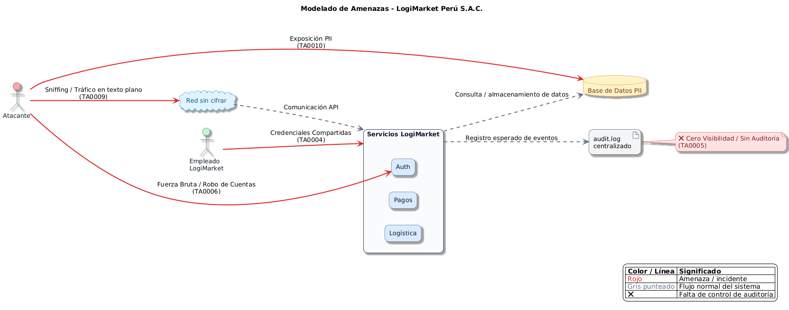

# Actividad 1: Identificación de Amenazas y Activos Críticos
**Caso de Estudio:** LogiMarket Perú S.A.C.

## 1. Enfoque del Análisis (NIST CSF 2.0)
Para realizar una evaluación integral de seguridad de nivel profesional, este análisis se rige bajo la función **IDENTIFY (Identificar)** y **GOVERN (Gobernar)** del marco **NIST Cybersecurity Framework (CSF) 2.0**. El objetivo es comprender el contexto de LogiMarket para priorizar los riesgos antes de pasar a las fases de Protección (Protect) y Detección (Detect).

**Activos Críticos Identificados:**
1. **Datos de los clientes (PII):** Información almacenada en la base de datos (NIST: Data Security).
2. **Sistema de Identidades:** Credenciales de usuarios y empleados (CISA: Identity Management).
3. **Comunicaciones API:** Red interna de microservicios de inventario, pagos y logística.
4. **Registros del sistema:** Logs y eventos de auditoría.

## 2. Modelado de Amenazas basado en MITRE ATT&CK
A partir de los incidentes detectados en LogiMarket, hemos mapeado las vulnerabilidades utilizando las tácticas del framework **MITRE ATT&CK (Enterprise Matrix)**:

* **Incidente 1: Accesos no autorizados a cuentas de clientes.**
  * *Táctica MITRE:* **TA0006 - Credential Access** (Acceso a Credenciales). 
  * *Explicación:* Atacantes explotando la falta de Autenticación Multifactor (MFA).

* **Incidente 2: Interceptación de tráfico entre servicios.**
  * *Táctica MITRE:* **TA0009 - Collection / TA0006 - Credential Access** (Adversary-in-the-Middle / Sniffing).
  * *Explicación:* Tráfico en texto plano. Requiere aplicar el principio de CISA "Secure by Design" cifrando las comunicaciones (HTTPS/TLS).

* **Incidente 3: Exposición accidental de datos personales.**
  * *Táctica MITRE:* **TA0010 - Exfiltration / TA0007 - Discovery**.
  * *Explicación:* Falta de control de acceso basado en roles (RBAC) en los endpoints de las APIs.

* **Incidente 4: Ausencia de mecanismos de auditoría.**
  * *Táctica MITRE:* **TA0005 - Defense Evasion** (Evasión de Defensas).
  * *Explicación:* Al no haber logs, un atacante puede moverse lateralmente sin ser detectado. Afecta directamente la capacidad **DETECT** del NIST CSF 2.0.

* **Incidente 5: Uso de credenciales compartidas por empleados.**
  * *Táctica MITRE:* **TA0004 - Privilege Escalation** (Escalada de privilegios).
  * *Explicación:* Falla grave de higiene cibernética (Cyber Hygiene) que impide el no repudio. Rompe los principios de "Zero Trust" promovidos por CISA.